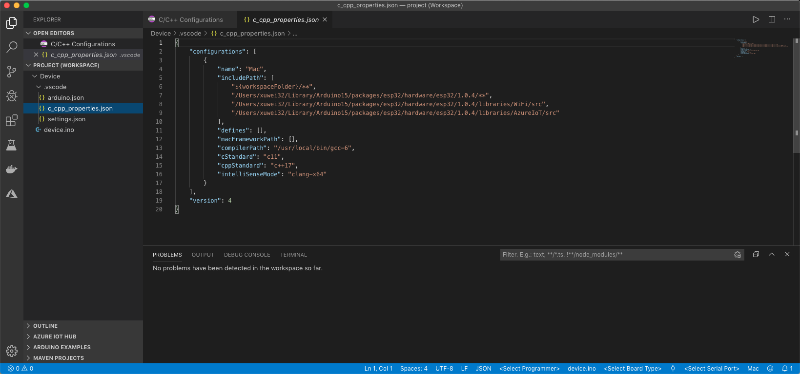

# Get Started with ESP32 Devices

For first-time users of ESP32 devices, follow these quick steps to:
- Prepare your development environment.
- Send information from the device to the Azure IoT Hub 
- Listen to cloud to device message with ESP32

## What you learn

* How to install the development environment.
* How to create an IoT Hub and register a ESP32 device.
* How to send sample data to your IoT hub.


## 环境准备
* ESP32设备：https://item.taobao.com/item.htm?spm=a1z09.2.0.0.45f72e8dwuIkw5&id=582095834615&_u=n1ajmjdae38
* macOS 10.14
* Azure账号


## Install development environment

We recommend [Azure IoT Device Workbench](https://marketplace.visualstudio.com/items?itemName=vsciot-vscode.vscode-iot-workbench) extension for Visual Studio Code to develop on the ESP32 devices.

Azure IoT Device Workbench provides an integrated experience to develop IoT solutions. It helps both on device and cloud development using Azure IoT and other services. You can watch this [Channel9 video](https://channel9.msdn.com/Shows/Internet-of-Things-Show/IoT-Workbench-extension-for-VS-Code) to have an overview of what it does.

Follow these steps to prepare the development environment for ESP32 devices:

1. Download and install [Arduino IDE](https://www.arduino.cc/en/Main/Software). It provides the necessary toolchain for compiling and uploading Arduino code.
   * Windows: Use Windows Installer version
   * macOS: Drag and drop the Arduino into `/Applications`
   * Ubuntu: Unzip it into `$HOME/Downloads/arduino-1.8.5`

2. Install [Visual Studio Code](https://code.visualstudio.com/), a cross platform source code editor with powerful developer tooling, like IntelliSense code completion and debugging.

3. Look for **Azure IoT Device Workbench** in the extension marketplace and install it.
    
    Together with the IoT Device Workbench, other dependent extensions will be installed.

4. Open **File > Preference > Settings** and add following lines to configure Arduino.

	* Windows

		```JSON
		"arduino.path": "C:\\Program Files (x86)\\Arduino",
		"arduino.additionalUrls": "https://dl.espressif.com/dl/package_esp32_index.json"
		```

	* macOS

		```JSON
		"arduino.path": "/Application",
		"arduino.additionalUrls": "https://dl.espressif.com/dl/package_esp32_index.json"
		```

	* Ubuntu

		```JSON
		"arduino.path": "/home/{username}/Downloads/arduino-1.8.5",
		"arduino.additionalUrls": "https://dl.espressif.com/dl/package_esp32_index.json"
		```

5. Use `F1` or `Ctrl+Shift+P` (macOS: `Cmd+Shift+P`) to open the command palette, type and select **Arduino: Board Manager**. Search for **esp32** and install the latest version.

    

## Build your first project

Now you are all set with preparing and configuring your development environment. Let us build a "Hello World" sample for IoT: sending simulated telemetry data to Azure IoT Hub.
Make sure your device is **not connected** to your computer. Start VS Code first, and then connect the ESP32 device to your computer.

## Open the project folder

### Open Azure IoT Device Workbench Examples

Use `F1` or `Ctrl+Shift+P` (macOS: `Cmd+Shift+P`) to open the command palette, type **Azure IoT Device Workbench**, and then select **Open Examples...**.


Select **ESP32 Arduino**.


Then the **IoT Device Workbench Example** window is shown up.


Find **ESP32 Get Started** and click **Open Sample** button. A new VS Code window with a project folder in it opens.


### Provision Azure service

In the solution window, open the command palette and select **Azure IoT Device Workbench: Cloud: Provision Azure Services...**.


Then VS Code guides you through provisioning the required Azure services.


The whole process includes:
* Select an existing IoT Hub or create a new IoT Hub.
* Select an existing IoT Hub device or create a new IoT Hub device. 

### Config Device Code

1. Open the source file(.ino) for device code and update the following lines with your WiFi ssid and password:
    ```csharp
		// Please input the SSID and password of WiFi
		const char* ssid     = "";
		const char* password = "";
    ```

2. Open the command palette and select **Azure IoT Device Workbench: Config Device Settings...**.

   

3. Select **Copy device connection string**.

	

   This copies the connection string that is retrieved from the `Provision Azure services` step.

4. Paste the device connection string into the following line in device code
    ```csharp
	/*String containing Hostname, Device Id & Device Key in the format:                         */
	/*  "HostName=<host_name>;DeviceId=<device_id>;SharedAccessKey=<device_key>"                */
	/*  "HostName=<host_name>;DeviceId=<device_id>;SharedAccessSignature=<device_sas_token>"    */
	static const char* connectionString = "";
    ```

### Build and upload the device code

1. Open the command palette and select **Azure IoT Device Workbench: Upload Device Code**.

	

2. VS Code then starts verifying and uploading the code to your DevKit.

	

3. The ESP32 device reboots and starts running the code.

## Test the project

### Send D2C message

Open serial monitor:

The sample application is running successfully when you see the following results:

* The Serial Monitor displays the message sent to the IoT Hub.


### Listen to C2D message

You can send message to your device with Azure Portal or other API. Please Make sure that serial monitor is open. Then you can see the message content from serial monitor.


## Problems and feedback

If you encounter problems, you can reach out to us from:
* [Gitter.im](https://gitter.im/Microsoft/vscode-iot-workbench)


## 更新的内容
针对ESP32 Azure IoT Kit这个开发板，有一些特定的配置：

* 打开串口调试（通用）


* 配置开发板（特定）


* 头文件include path配置

导入示例代码以后，发现头文件找不到，解决方案：
	1. 搜索头文件的名称，例如”wifi.h“这个头文件，找到路径如下：
		1.1 /Users/xuwei32/Library/Arduino15/packages/esp32/hardware/esp32/1.0.4/libraries/WiFi/src/WiFi.h
		1.2 /Applications/Arduino.app/Contents/Java/libraries/WiFi/src/WiFi.h
		1.3 /Users/xuwei32/Library/Arduino15/packages/esp32/hardware/esp32/1.0.4/libraries/AzureIoT/src/Esp32MQTTClient.h
	2. 设置vscode，修改include path，如下图所示：




